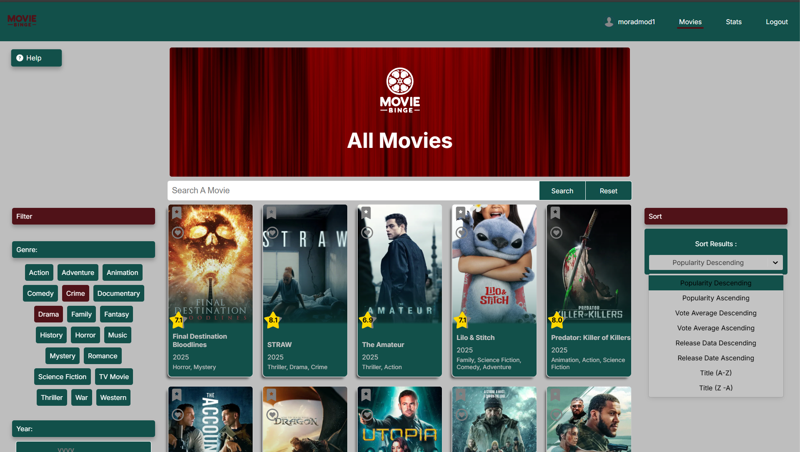
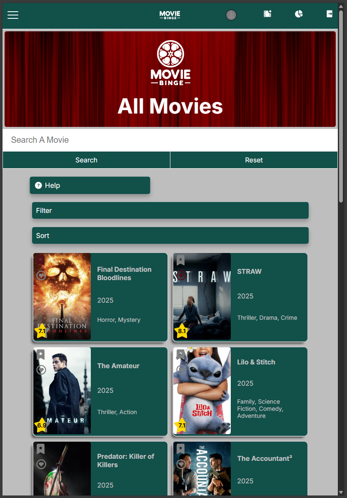
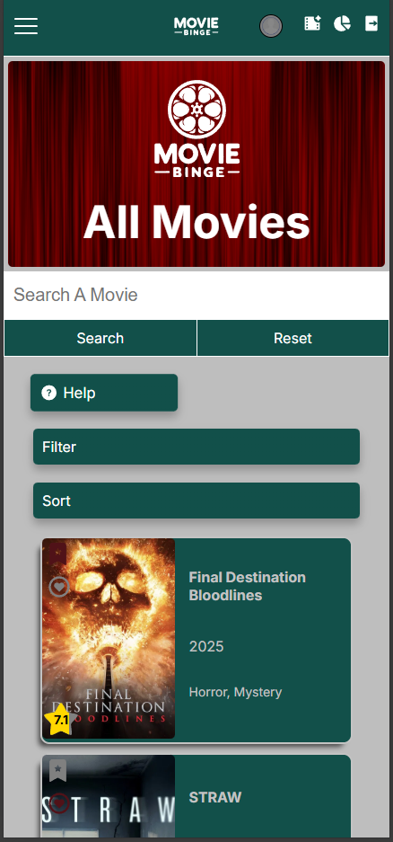

# Movie Binge

A Movie Database (using TMDB) that allows users to search, filter and discover all the latest movies. Furthermore users can register to bookmark,like, review and create movie lists on the go. More functionality is progressively being added.

## Table of contents

- [Overview](#overview)
  - [The Issue](#the-issue)
  - [Screenshot](#screenshot)
  - [Links](#links)
- [Achievment and Goals](#achieve-and-goals)
- [My process](#my-process)
  - [Built with](#built-with)
  - [Useful resources](#useful-resources)
  - [Responsive Images](#responsive-images)
- [Author](#author)

## Overview

## The Issue

The issue to be solved was: needing a website that can help users find a movie to watch, going through the latest movies and filtering to your ideals. This has been done, but most websites contain a lot of pages and clicking to go through before reaching the desired outcome. Also this is a more simple verson that solves the issue at hand. This is aided with users being able to review and like multiple movies for others to gain insight into popular moviews based on the user community.

### Screenshot

I have added a screenshot of the project, from the movie library page:

### Links

- Project URL: [Github Repo](https://github.com/Morad17/react-movie-db)
- Live Site URL: [Live Site](https://movie-binge-app.netlify.app/)

## Achievent and Goals

### Achievement

- The initial goal of creating a movie database, and being able to like,bookmark and review has been achieved.
- The styling has been completed to around 90% of my expectiation, anmiations and transitions have been implemented to create a visually appealing app.
- Users are able to create an account for their personalied bookmarks,reviews,and likes.

## Goals

- I would like to create out the user page, which will contain a carousel of the movies they have selected.
- Creating users lists is an implementation I would like to include
- Some more subtle styling is needed, e.g. the reviews on the page and other small alterations.
- more testing of the app the make sure it can't break

## My process

### Built with

- [React](https://reactjs.org/) - JS library
- TMDB database API - for the movie information and images
- Node
- Mysql (Hosted on Aiven)
- Cloudinary for Image uploads
- SCSS styling properties and variables
- Consideration for mobile and tablet devices
- [React Testing](https://testing-library.com/docs/react-testing-library/intro/) and [Jest](https://jestjs.io/) testing libraries for testing the component

### Useful resources

- [Responsive devices checker](https://usepastel.com/responsive-website-test) - As well as inspector on chrome, this website checker was used to reaffirm the responsiveness on smaller screen sizes.

### Responsive Images

## Author

Morad Elbouchikhi
